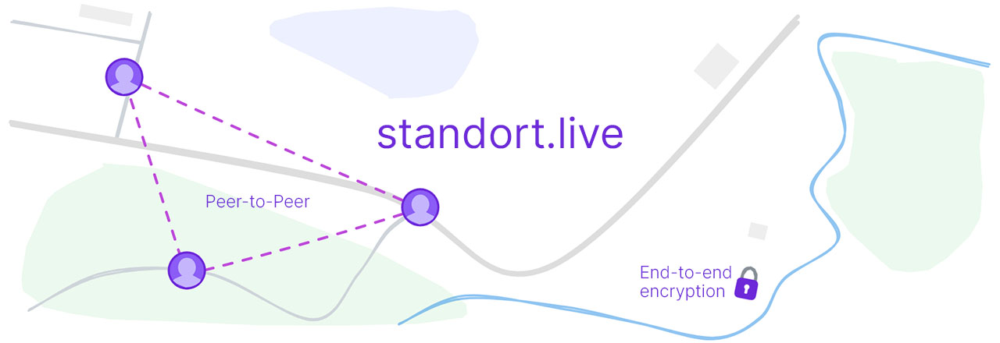

<div align="center">
  <h2>
    Standort.live - Share your location with friends and family
  </h2>
</div>

<br />

<div align="center">


</div>

<br />

## Introduction

"Standort" is a web application that makes it easy to share your location with friends and family. Your location remains private because sensitive information is only shared with people you trust using WebRTC.

## Installation

Requirements:

- Node.js 18+
- npm 9+

```sh
npm install
```

```sh
npm run build
```

Run development mode:

```sh
npm run dev
```

## Configuration

Environment variables for `signaling` service:

- `SIGNALING_PORT`: Listening port (Default: `4000`).
- `SIGNALING_API_KEY` Restrict by an API key (Default: _empty_),

Environment variables for `web` application:

- `VITE_SIGNALING_URL`: Signaling Websocket URL (Default: `ws://localhost:4000`)
- `VITE_SIGNALING_API_KEY`: Signaling API key (Default: _empty_)

> Copy the `.env.sample` to `.env` and customize your configuration.
