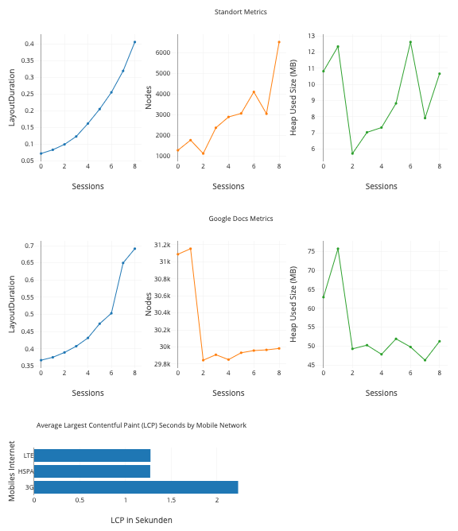
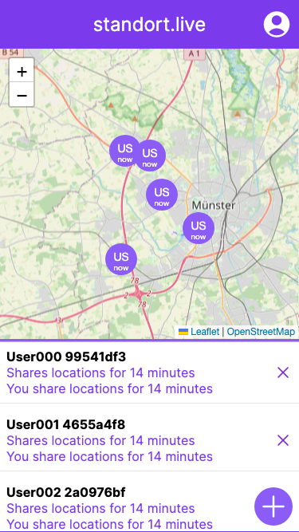

## How to measure the application

The `run.js` script allows you to measure the performance of web applications.

> Make sure you are followed the "Installation" instructions on the [README](../README.md)

## Usage

To use the script, open your terminal and navigate to the directory where the script is located. Then run the following command:

```sh
node run.js [options]
```

Replace [options] with one or more of the following options:

- `--lcp-url`: The URL to measure LCP for.
- `--lcp-iterations`: The number of times to measure LCP for the given URL. The default value is 3.
- `--standort-url`: The URL to measure the performance of the Standort app.
- `--standort-clients-number`: The number of clients to simulate when measuring the performance of the Standort app. The default value is 8.
- `--docs-url`: The URL to measure the performance of Google Docs (NOTE: The Google Doc must be public available!).
- `--docs-clients-number`: The number of clients to simulate when measuring the performance of Google Docs. The default value is 8.
- `--standort-screens-url`: The URL to take screenshots of the Standort app.
- `--standort-screens-clients-number`: The number of clients to simulate. The default value is 2.

### Example: LCP and Metrics for Standort and Docs

```sh
node run.js \
    --lcp-url=https://standort.live \
    --lcp-iterations=5 \
    --standort-url=https://standort.live \
    --standort-clients-number=30 \
    --docs-url=https://docs.google.com/document/d/xxxxxxxxx \
    --docs-clients-number=8
```

**Output:**

- Open `plot.html` in your browser to view the charts.
- The `output` folder contains all files (e.g screenshots and metrics in a `*.js` file)

Example Plots:  

<br />
Example Screenshot:  


### Example: Screenshots for every Step

```sh
node run.js \
    --standort-screens-url=https://standort.live \
    --standort-screens-clients-number=2
```

**Output:**

- The `output` folder contains all screenshots
